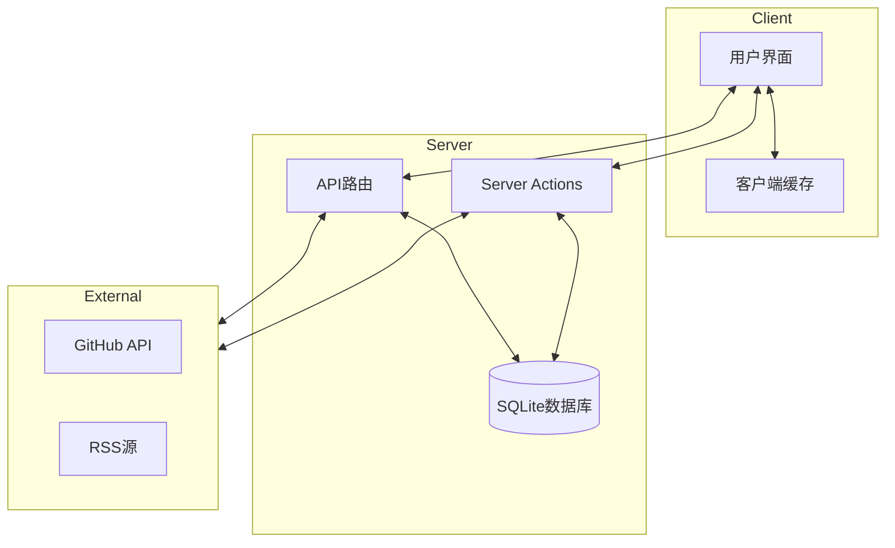
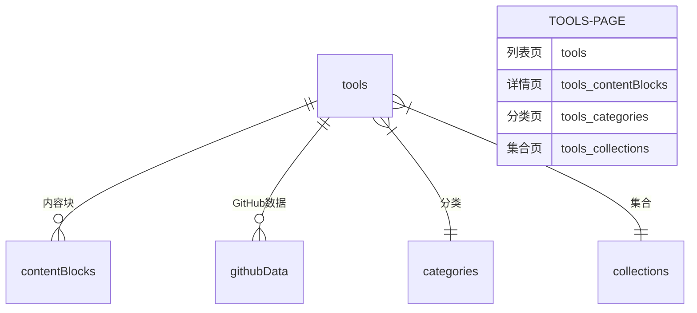
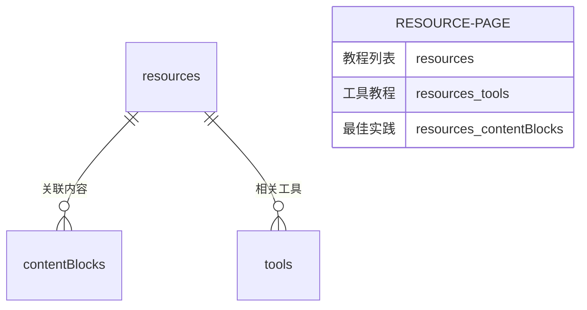
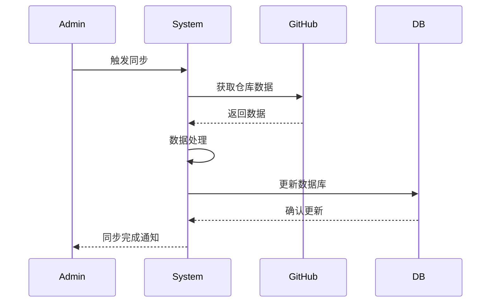
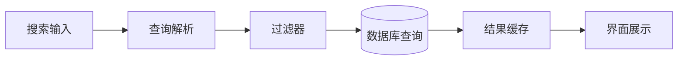
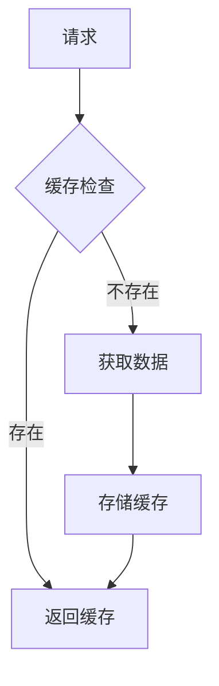

## 完整工作流程

1. 内容管理流程
   内容管理流程创建工具
   ↓
   配置内容源（官方文档/GitHub 等）
   ↓
   触发内容同步
   ↓
   解析为内容块
   ↓
   组织展示内容
2. 同步更新流程
   定期检查内容源
   ↓
   执行同步任务
   ↓
   更新内容块
   ↓
   记录同步日志
3. 内容展示流程
   访问工具页面
   ↓
   获取所有内容块
   ↓
   按类型和顺序组织
   ↓
   渲染页面
4. 核心数据流图

5. 页面与数据库关系

- 工具页面 (/tools)

- 资源中心 (/resources)

6. 实施步骤优先级
   第一阶段：核心功能
   [ ] 工具基础 CRUD
   [ ] 分类系统
   [ ] 基础搜索
   第二阶段：内容管理
   [ ] 内容块系统
   [ ] GitHub 集成
   [ ] 资源中心
   第三阶段：高级特性
   [ ] 高级搜索
   [ ] 个性化推荐
   [ ] 数据统计
7. 数据同步流程

8. 搜索系统设计

9. 缓存策略

